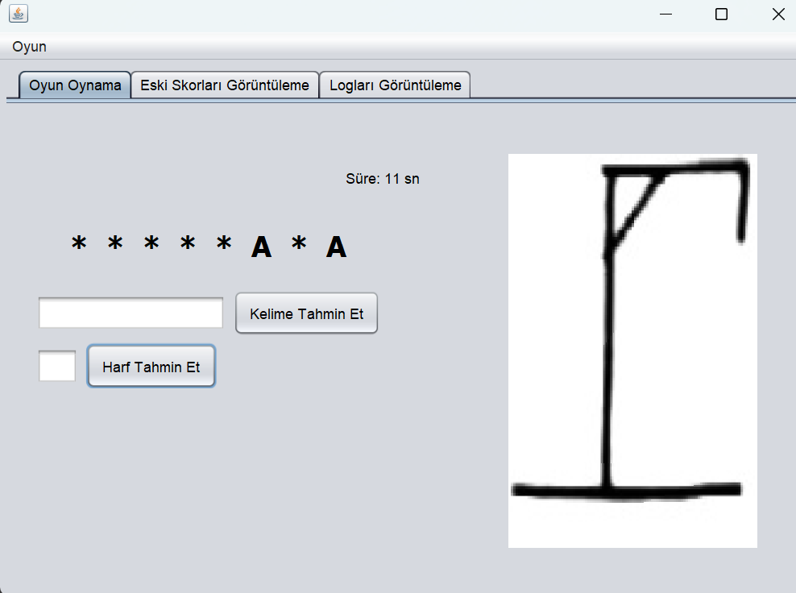
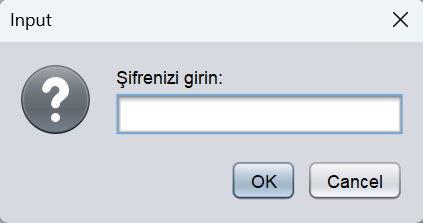
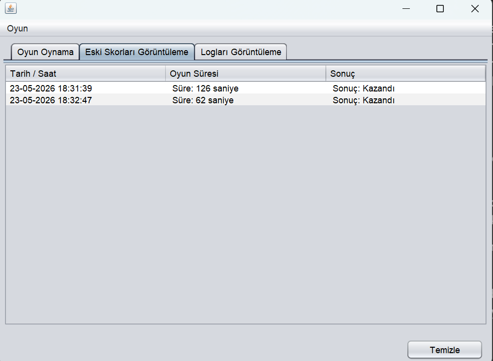

# 🎯 Adam Asmaca (Hangman) - Java Swing Projesi

Bu proje, Java ve Swing GUI kullanılarak geliştirilmiş, masaüstü tabanlı ve dosya yönetim sistemine sahip bir Adam Asmaca oyunudur. Üniversite proje ödevi kapsamında, nesne yönelimli programlama (OOP), olay güdümlü programlama (Event-Driven) ve dinamik arayüz yönetimi mimarilerini pratik etmek amacıyla geliştirilmiştir.

 

---

## 🚀 Proje Özellikleri ve Dinamikleri

Klasik bir adam asmaca oyununun ötesinde, proje arka planda çeşitli veri kayıt ve güvenlik algoritmaları barındırmaktadır:

* **Şifreli Giriş Sistemi:** Uygulama açıldığında `sifre.txt` üzerinden doğrulama yapar. İlk girişte şifre oluşturulur. 3 hatalı girişte sistem kendini kilitler.
* **Dinamik UI Üretimi:** Seçilen kelimenin harf sayısına göre anlık olarak `JPanel` içerisine `JLabel` nesneleri (yıldızlar) türetilir.
* **Loglama Mimarisi:** Sisteme yapılan her giriş denemesi, tarih ve saat damgasıyla (timestamp) birlikte `log.txt` dosyasına "Append (Ekleme)" modunda kaydedilir.
* **Skor ve Zaman Takibi:** Oyun esnasında bir `javax.swing.Timer` saniye bazında sayım yapar. Oyun bittiğinde sonuç ve süre `oyunlar.txt` dosyasına işlenir.
* **Yetkili Temizleme:** Log ve skor tablolarını arayüzden temizlemek, ana şifrenin tekrar girilmesini gerektirir.

---

## 📸 Ekran Görüntüleri

### Sistem Giriş ve Güvenlik

> *Sisteme izinsiz girişleri ve skor tablosuna müdahaleyi engelleyen şifre ekranı.*

### Skor ve Log Takibi (JTable)

> *Geçmiş oyunların süre ve sonuç bazlı listelendiği, dışarıdan müdahaleye (düzenlemeye) kapalı tablo mimarisi.*

---

## 📁 Dosya ve Klasör Hiyerarşisi

Uygulamanın sorunsuz çalışabilmesi ve kaynakların (resim/metin) doğru okunabilmesi için bilgisayarın `C:\` dizininde aşağıdaki dosya hiyerarşisinin bulunması şarttır. Proje kodları bu yolları (Class Variable) sabit değişkenler olarak referans alır.

```text
C:\
└── P2Oyun\
    ├── Resimler\ 
    │   ├── 1.jpg
    │   ├── ...
    │   └── 11.jpg
    └── TXTDosyalar\
        ├── kelimeler.txt (Oyunun kelime havuzu - En az 6 harfli 30 kelime)
        ├── sifre.txt     (Giriş şifresinin tutulduğu alan)
        ├── log.txt       (Sistem hareketlerinin tutulduğu alan)
        └── oyunlar.txt   (Maç sonuçlarının tutulduğu alan)
